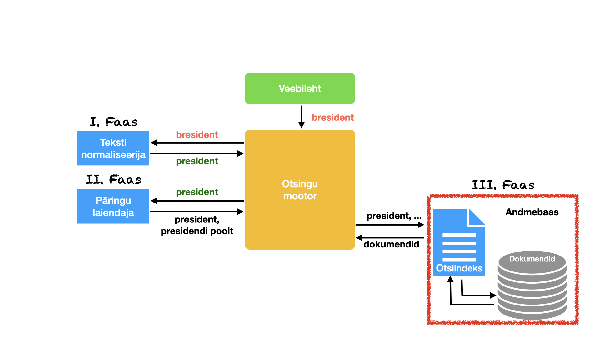

# SMARTSEARCH

## Miks?

Tihti on olemasolevale infosüsteemile raske lisada otsingufunktsionaalsust, mis arvestaks eestikeele eripäradega:

* Reeglina soovitakse leida dokumentidest kõiki otsingufraaside vorme (näiteks president, presidendi, presidenti, ...)
* Tihti soovitakse korrigeerida kasutaja poolt otsisõna kirjutamisel tehtud trüki- ja ortograafiavigu (arhidekt, reeglisdtik, ...) 
* Tihti on kasulik teisendada kasutaja otsisõnad dokumentides kasutatavateks teminoloogiaks (üksratas, hoverboard &rarr; tasakaaluliikur, jalgrattatee &rarr; kergliiklustee)
* Vahel soovitakse automaatset sõnalõpetust, mis piisava arvu tähtede sisestamisel pakub ise  välja võimalikud otsisõnade kandidaadid.

Antud projekti eesmärgiks on luua nende eesmärkide saavutamiseks vajalikud tarkvarakomponendid, mida saab suhteliselt lihtsalt liidestada olemasolevate infosüsteemidega.

## Kuidas?

Iga otsigu saab jagada neljaks faasiks:

* otsisisendi normaliseerimine;
* andmebaasi päringu koostamine;
* dokumentide andmebaasist otsimine;
* leitud dokumentide filtreerimine ja dekoreerimine.  

Ülal toodud eesmärkide saavutamiseks piisab enamasti joonisel toodud komponentide lisamisest olemasolevasse otsingumoodulisse.

Antud projekti raames loome me kõik vajalikud komponendid veebiteenustena ning näitame lihtsate demorakendustega, kuidas vastavaid komponente kasutada.

## Näiterakendused

### I. Dokumentide indekseerimine

Toimiva otsingu aluseks on korrektselt indekseeritud dokumendid. Standardsed andmebaasilahendused ei arvesta eestikeelsete tekstide omapära ning seetõttu on otsingutulemused tihti kehvapoolsed.

Antud näiterakenduse eesmärk on demonstreerida keeletehnoloogiliste vahendite kasutamist oluliselt sisukama indeksi moodustamiseks ja millist informatsiooni on otstarbekas indeksis esitada.

* [selgitused näiterakenduse kohta](https://github.com/estnltk/smart-search/blob/main/wp/wp_indekseerija/README.md)
* [näiterakendus](https://smart-search.tartunlp.ai/wp/indekseerija/process)
* [näiterakenduse lähtekood](https://github.com/estnltk/smart-search/tree/main/wp/wp_indekseerija)

### II. Otsisisendi normaliseerimine

Antud näiterakendus demonstreerib lemmatiseerimise ja sõnavormide genereerimise veebiteenuse kasutamist otsisisendi normaliseerimiseks.

* [selgitused näiterakenduse kohta](https://github.com/estnltk/smart-search/blob/main/wp/wp_paring/README.md)
* [näiterakendus](https://smart-search.tartunlp.ai/wp/paring/process)
* [näiterakenduse lähtekood](https://github.com/estnltk/smart-search/tree/main/wp/wp_paring)

### III. Nutika otsingu demorakendus

Antud näiterakendus demonstreerib indekseerimise ja otsingusõnede normaliseerimise veebiteenuste kasutamist meid huvitavate dokumentide filtreerimiseks ja dekoreerimiseks (leitud otsisõnede märgendamiseks dokumendis).

* [selgitused näiterakenduste kohta](https://github.com/estnltk/smart-search/blob/main/wp/wp_otsing/README.md)
* näiterakendused
  * [Algvormipõhine otsing](https://smart-search.tartunlp.ai/wp/otsing-lemmad/process)
  * [Sõnepõhine otsing](https://smart-search.tartunlp.ai/wp/otsing-soned/process)
* [näiterakenduste lähtekood](https://github.com/estnltk/smart-search/tree/main/wp/wp_otsing)

## Veebiteenused

Programmeerija jaoks mõeldud liidesega veebiteenused:

* [Dokumentides sisalduvate algvormide (lemmade) indekseerimine](https://github.com/estnltk/smart-search/tree/main/api/indekseerija_lemmad)
* [Dokumentides sisalduvate sõnavormide indekseerimine](https://github.com/estnltk/smart-search/tree/main/api/indekseerija_soned)
* [Otsisiendi normaliseerimine algvorme (lemmasid) sisaldava indeksi korral](https://github.com/estnltk/smart-search/tree/main/api/paring_lemmad)
* [Otsisiendi normaliseerimine sõnavorme sisaldava indeksi korral](https://github.com/estnltk/smart-search/tree/main/api/paring_soned)
<!---
* [Sõnestamise ja lausestamise veebiteenus](https://github.com/estnltk/smart-search/blob/main/api/README-tokenizer.md)
* [Morfoloogilise analüüsi veebiteenus](https://github.com/estnltk/smart-search/blob/main/api/README-analyser.md)
* [Morfoloogilise genereerimise veebiteenus](https://github.com/estnltk/smart-search/blob/main/api/README-generator.md)
-->

## Repo kataloogistruktuur

* [**_documentation_**](https://github.com/estnltk/smart-search/tree/main/documentation) -- Üldisemat laadi dokumentatsioon. Enamasti on töövahendi kohta käiv dokumentatsioon töövahendi lähtekoodiga samas kataloogis.
* [**_wp_**](https://github.com/estnltk/smart-search/tree/main/wp) -- veebilehed töövahendite demonstreerimiseks.
  * [**_wp_otsing_**](https://github.com/estnltk/smart-search/tree/main/wp/wp_otsing) -- nutika otsingu demorakendus
  * [**_wp_indekseerija_**](https://github.com/estnltk/smart-search/tree/main/wp/wp_indekseerija) -- veebileht dokumentide indekseerimise demonstreerimiseks.
  * [**_wp_paring_**](https://github.com/estnltk/smart-search/tree/main/wp/wp_paring) -- veebileht otsisõnede normaliseerimise demonstreerimiseks.
* [**_api_**](https://github.com/estnltk/smart-search/tree/main/api) -- programmeerija jaoks mõeldud liidesega veebiteenused.
  * [**_indekseerija_lemmad_**](https://github.com/estnltk/smart-search/tree/main/api/indekseerija_lemmad) -- lemmasid sisaldava indeksi tegemine.
  * [**_indekseerija_soned_**](https://github.com/estnltk/smart-search/tree/main/api/indekseerija_soned) -- sõnavorme sisaldava indeksi tegemine.
  * [**_paring_lemmad_**](https://github.com/estnltk/smart-search/tree/main/api/paring_lemmad) -- otsisõnede normaliseerimine lemmasid sisaldava indeksi korral.
  * [**_paring_soned_**](https://github.com/estnltk/smart-search/tree/main/api/paring_soned) -- otsisõnede normaliseerimine sõnavorme sisaldava indeksi korral.
* [**_testkorpused_**](https://github.com/estnltk/smart-search/tree/main/testkorpused) -- testimiseks möeldud korpused ja abistava iseloomuga skriptid.
  * [**_bin_**](https://github.com/estnltk/smart-search/tree/main/testkorpused/bin) -- abistava iseloomuga skriptid.
  * [**_riigiteataja_**](https://github.com/estnltk/smart-search/tree/main/testkorpused/riigiteataja) -- riigiteataja dokumentidest koostatud mikrokorpus testimiseks.
* **_demo_otsing_** -- see funktsionaalsus on uuenenud kujul [**_wp_**](https://github.com/estnltk/smart-search/tree/main/wp) ja [**_api_**](https://github.com/estnltk/smart-search/tree/main/api) kataloogides.
* ülejäänud kataloogid -- ei ole enam olulised

