# Otsingumootor

---
---

## 1 Lemmapõhine otsing

---

### 1.1 Kuidas töötab

---

* Leitakse kõigi tekstikorpuse sõnede algvormid (lemmad) ja koostatakse nende põhjal indeks.
* Päringusõnede normaliseerimise käigus leitakse päringusõnedele vastavad algvormid.
* Otsimootor otsib päringusõnedele vastavaid algvorme (lemmasid) lemmade indeksist.

### 1.2 Näited

---

#### 1.2.1 Algsete päringusõnede asemel normaliseeritud kuju näitamine

---

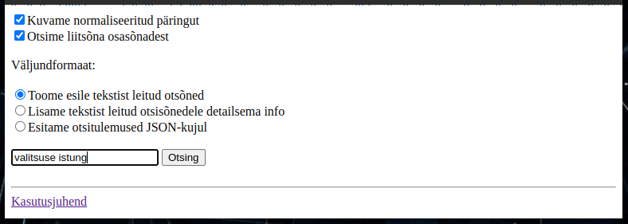

* Vali ```Kuvame normaliseeritud päringut```
* Kliki ```Otsing``` nuppu

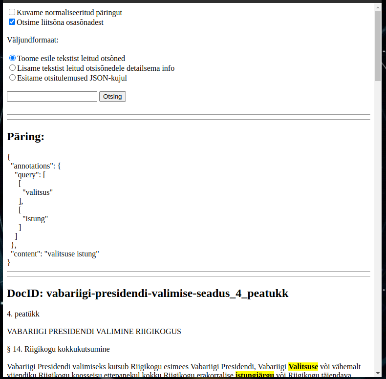

#### 1.2.2 [Tekstikorpusest otsimine. Leitud otsisõnad on tekstis esiletoodud.](https://smart-search.tartunlp.ai/wp/otsing-lemmad/process)

---

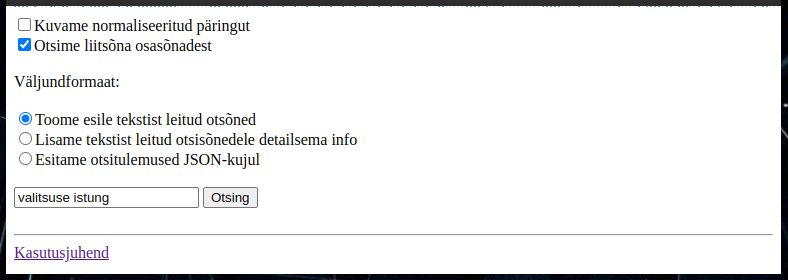

Kliki ```Otsing``` nuppu.

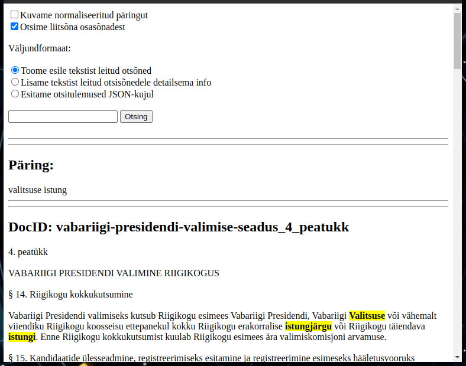

Ruumi kokkuhoiu huvides on keskmine osa pildist äralõigatud.

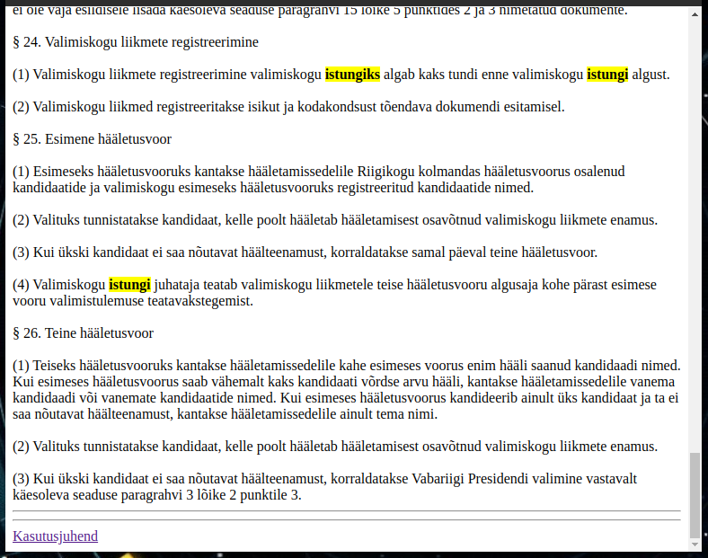

#### 1.2.3 [Tekstikorpusest otsimine. Iga tekstist leitud otsisõna juurde on kaldkirjas lisatud vastavad algvormid päringust.](https://smart-search.tartunlp.ai/wp/otsing-lemmad/process)

---

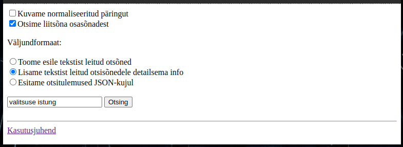

Vali ```Lisame tekstist leitud otsisõnedele detailsema info```
Kliki ```Otsing``` nuppu.

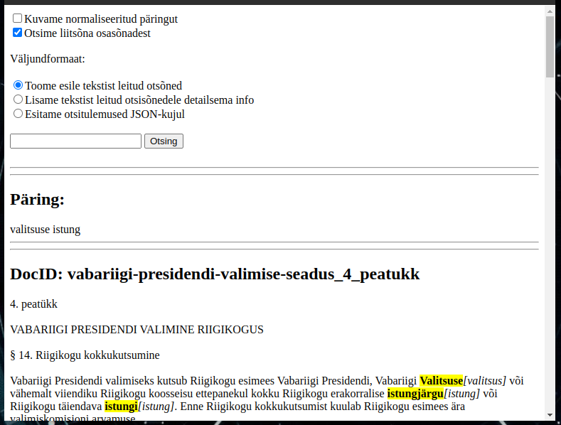

Ruumi kokkuhoiu huvides on keskmine osa pildist äralõigatud.

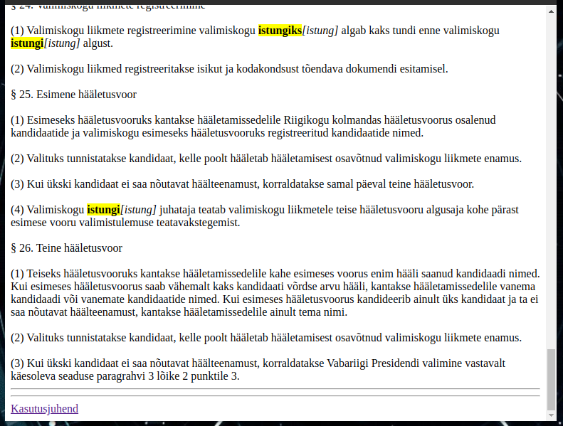

#### 1.2.4 [Tekstikorpuse kuvamine](https://smart-search.tartunlp.ai/wp/otsing-lemmad/texts)

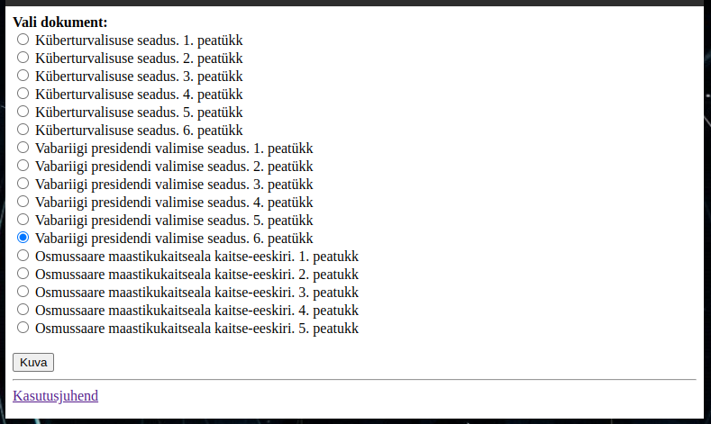

* Vali tekst vaatamiseks.
* Kliki ```Kuva``` nuppu.

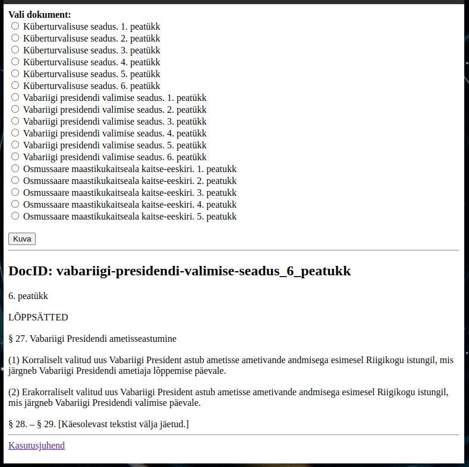

#### 1.2.5 [Versiooni-info kuvamine](https://smart-search.tartunlp.ai/wp/otsing-lemmad/version)

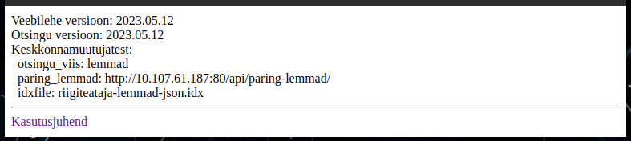

---
---

## 2. Sõnepõhine otsing

---

### 2.1 Kuidas töötab

---

* Tüüpiliselt kasutatakse sellist otsingut siis kui lemmade indeksit pole võimalik varem valmis  teha.
* Päringusõnede normaliseerimise käigus leitakse päringusõnedele vastavad lemmad ja genereeritakse
  neist kõikvõimalikud (käändes/pöördes) vormid.
* Otsimootor hakkab tekstikorpust otsast läbi vaatama otsides päringusõnade normaliseerimise 
  käigus leitud sõnavorme. Käesolevas "proof of concept" realisatsioonis oleme korpuse sõnavormidest
  indeksi varem valmis genereerinud (analoogiliselt lemmade indeksiga).

### 2.2 Näited

---

### 2.2.1 Algsete päringusõnede asemel normaliseeritud kuju näitamine

---

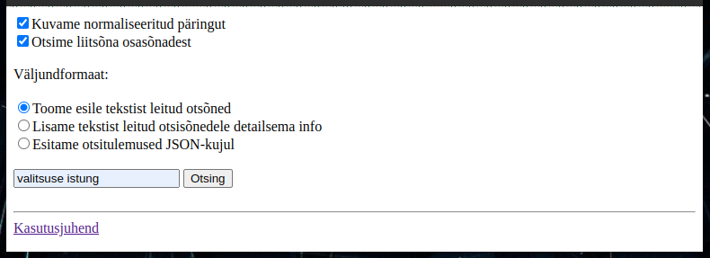

* Vali ```Kuvame normaliseeritud päringut```
* Kliki ```Otsing``` nuppu

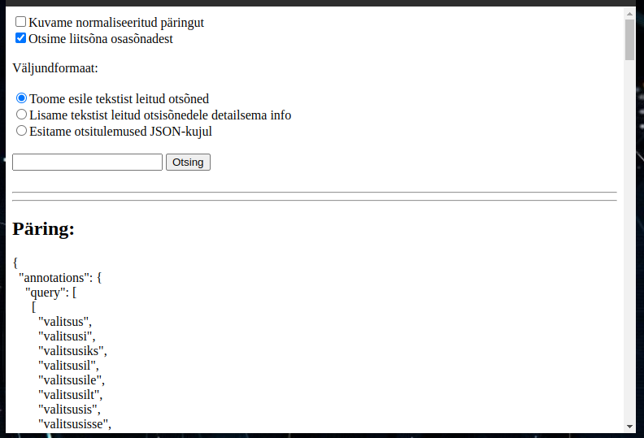

Ruumi kokkuhoiu huvides on alumine osa pildist äralõigatud.


#### 2.2.2 [Tekstikorpusest otsimine. Leitud otsisõnad on tekstis esiletoodud.](https://smart-search.tartunlp.ai/wp/otsing-soned/process)

---

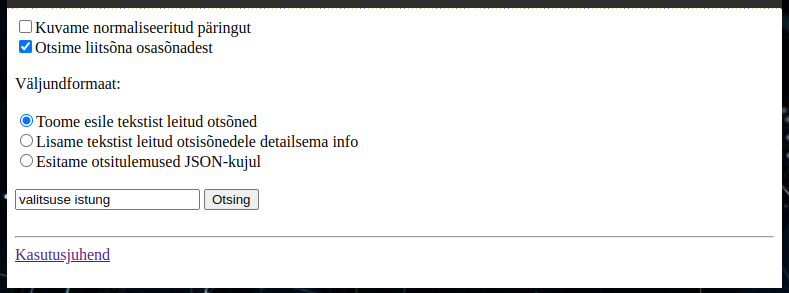

Kliki ```Otsing``` nuppu.

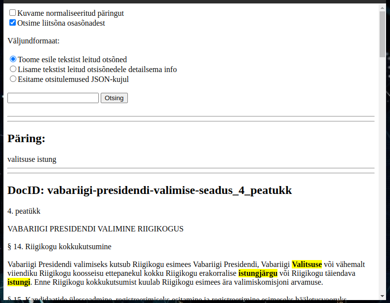

Ruumi kokkuhoiu huvides on pildilt keskmine osa äralõigatud.

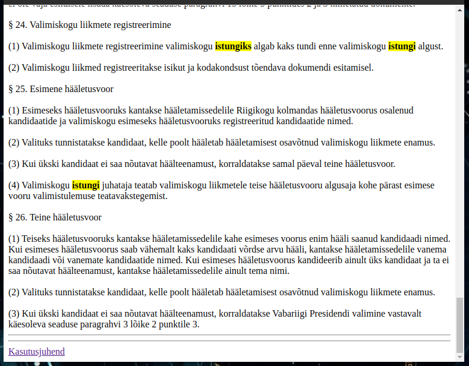


#### 2.2.3 [Tekstikorpusest otsimine. Iga tekstist leitud otsisõna juurde on kaldkirjas lisatud vastavad algvormid päringust.](https://smart-search.tartunlp.ai/wp/otsing-soned/process)

---

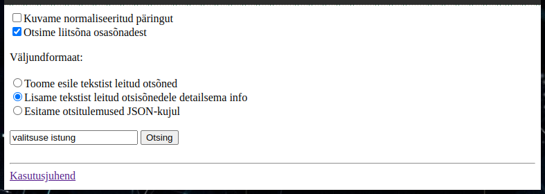

* Vali ```Lisame tekstist leitud otsisõnedele detailsema info```
* Kliki ```Otsing``` nuppu.

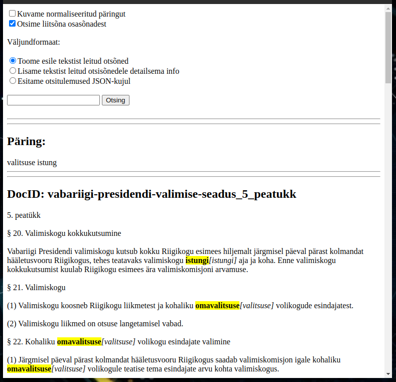

Ruumi kokkuhoiu huvides on pildilt keskmine osa äralõigatud.

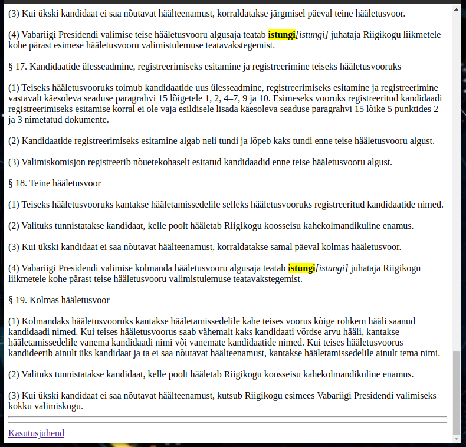

#### 2.2.4 [Tekstikorpuse kuvamine](https://smart-search.tartunlp.ai/wp/otsing-soned/texts)

---

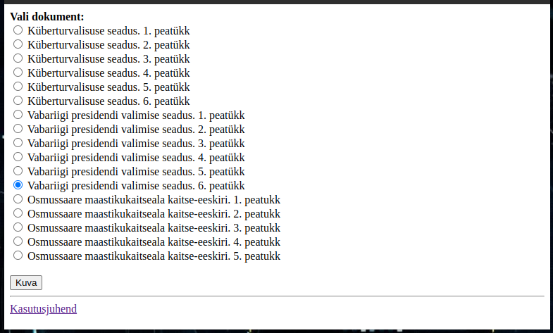

* Vali tekst vaatamiseks.
* Kliki ```Kuva``` nuppu.

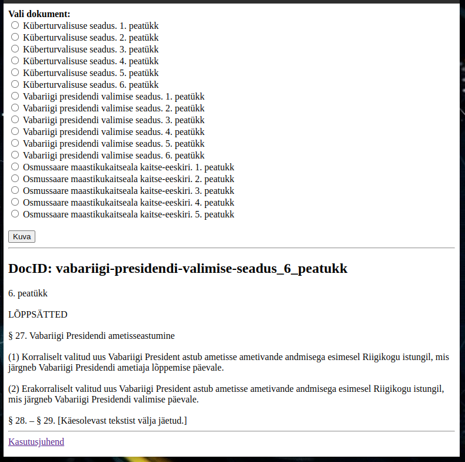

* [Versiooni-info kuvamine](https://smart-search.tartunlp.ai/wp/otsing-soned/version)

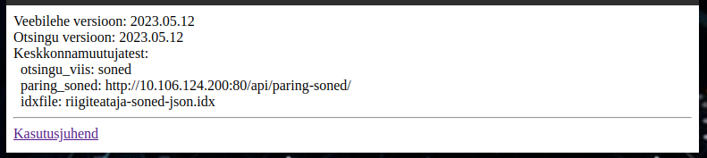
