# Otsingumootor

## Lemmapõhine otsing

---

### Kuidas töötab

* Leitakse kõigi tekstikorpuse sõnede algvormid (lemmad) ja koostatakse nende põhjal indeks.
* Päringusõnede normaliseerimise käigus leitakse päringusõnedele vastavad algvormid.
* Otsimootor otsib päringusõnedele vastavaid algvorme (lemmasid) lemmade indeksist.

### Näited

* [Tekstikorpusest otsimine](https://smart-search.tartunlp.ai/wp/otsing-lemmad/process)

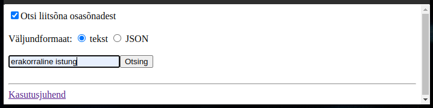

Kliki ```Otsing``` nuppu.

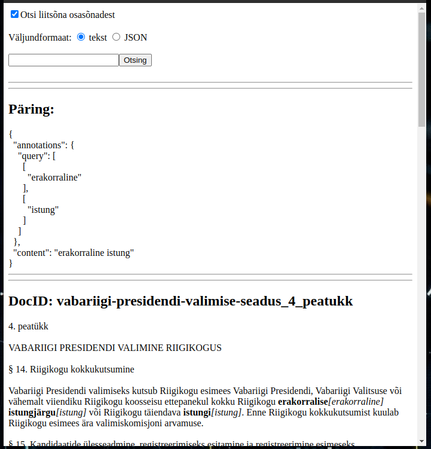

Ruumi kokkuhoiu huvides on keskmine osa pildist äralõigatud.

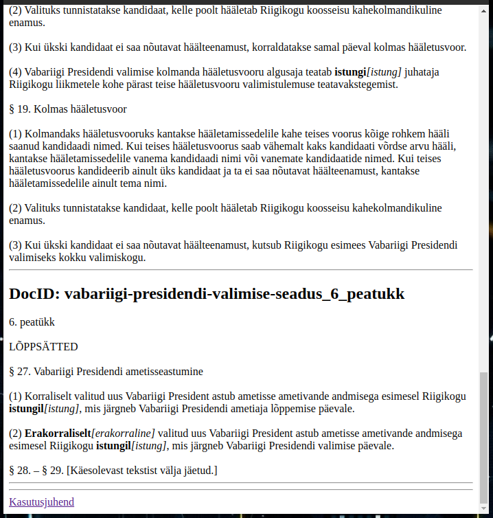

* [Tekstikorpuse kuvamine](https://smart-search.tartunlp.ai/wp/otsing-lemmad/texts)

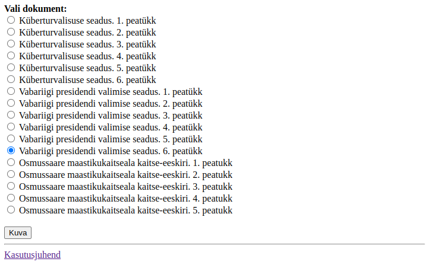

Kliki ```Kuva``` nuppu.

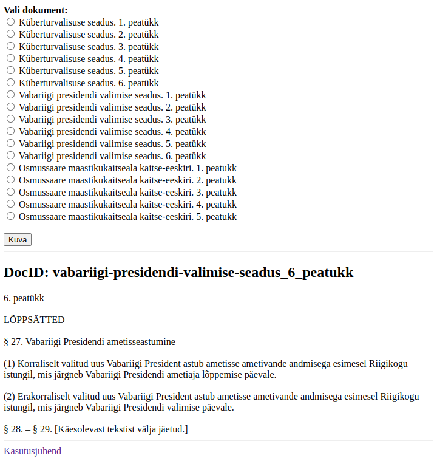

* [Versiooni-info kuvamine](https://smart-search.tartunlp.ai/wp/otsing-lemmad/version)

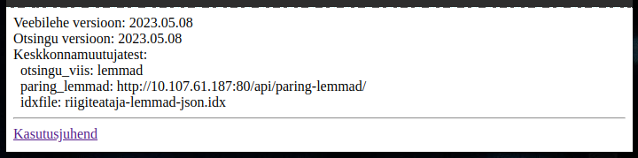

## Sõnepõhine otsing

---

### Kuidas töötab

* Tüüpiliselt kasutatakse sellist otsingut siis kui lemmade indeksit pole võimalik varem valmis  teha.
* Päringusõnede normaliseerimise käigus leitakse päringusõnedele vastavad lemmad ja genereeritakse
  neist kõikvõimalikud (käändes/pöördes) vormid.
* Otsimootor hakkab tekstikorpust otsast läbi vaatama otsides päringusõnade normaliseerimise 
  käigus leitud sõnavorme. Käesolevas "proof of concept" realisatsioonis oleme korpuse sõnavormidest
  indeksi varem valmis genereerinud (analoogiliselt lemmade indeksiga).

### Näited

* [Tekstikorpusest otsimine](https://smart-search.tartunlp.ai/wp/otsing-soned/process)

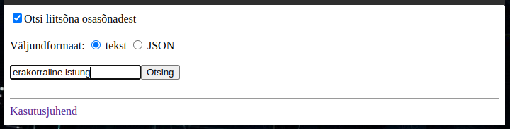

Kliki ```Otsing``` nuppu.

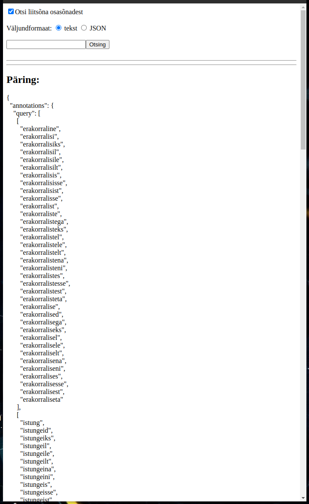

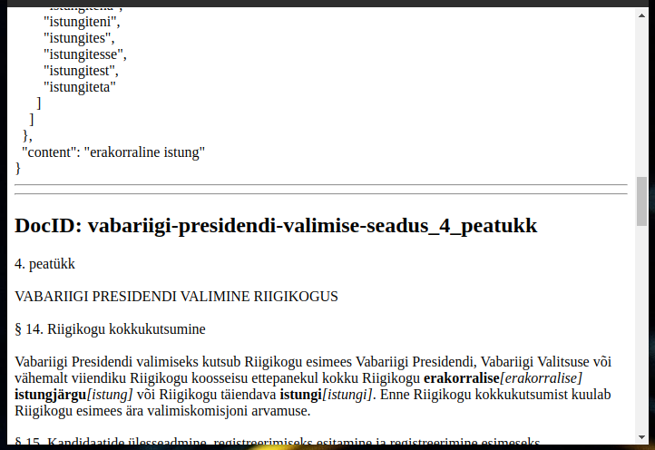

Ruumi kokkuhoiu huvides on pildilt otsingutulemuste alumine osa äralõigatud.

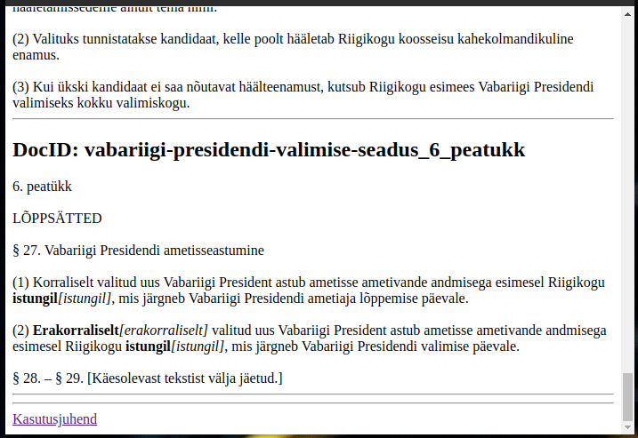

* [Tekstikorpuse kuvamine](https://smart-search.tartunlp.ai/wp/otsing-soned/texts)


Kliki ```Kuva``` nuppu.


* [Versiooni-info kuvamine](https://smart-search.tartunlp.ai/wp/otsing-soned/version)

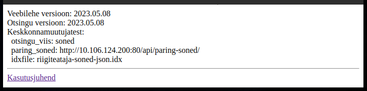
