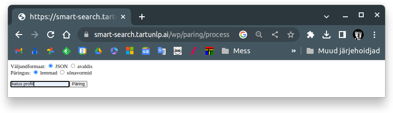
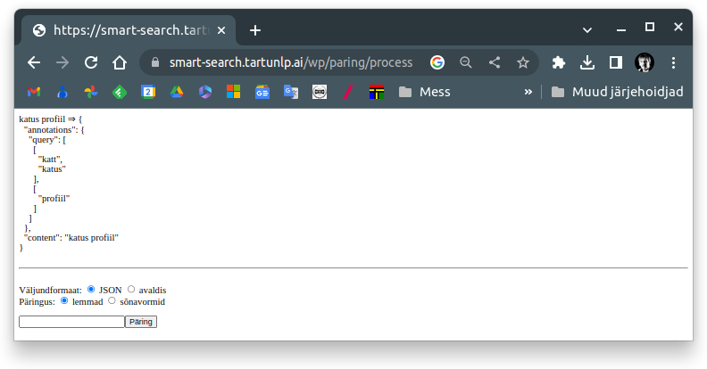
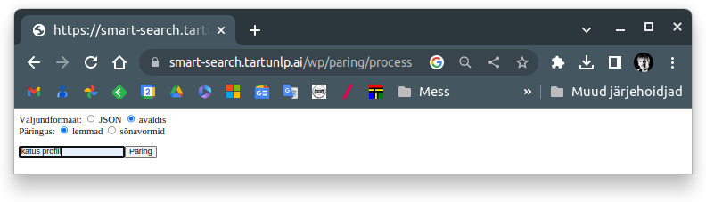
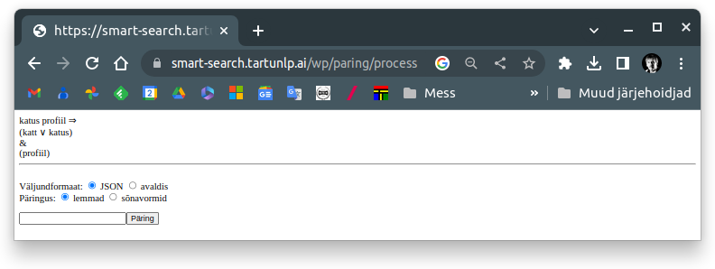
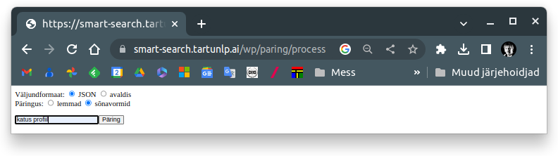
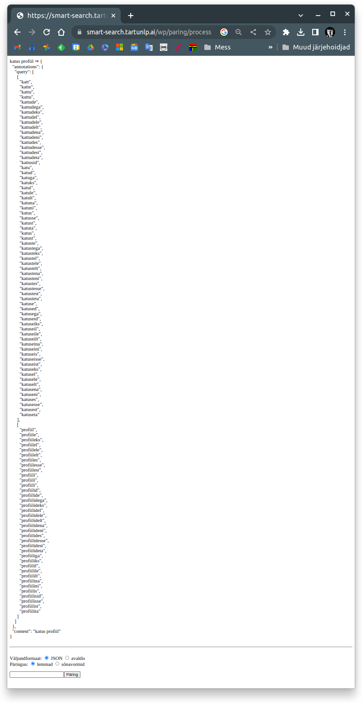
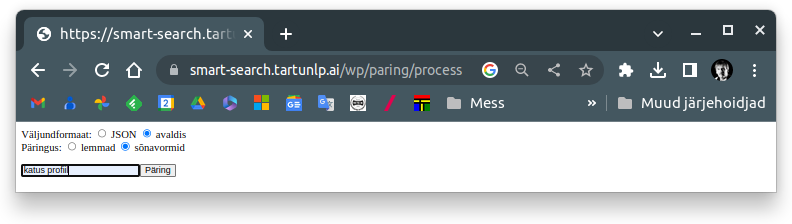
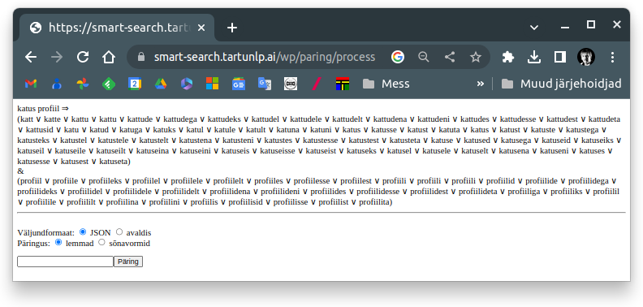

# Veebileht otsisisendi normaliseerimisteenuste demonstreerimiseks [versioon 2023.04.29.2]

[Link veebilehele TÜ serveris](https://smart-search.tartunlp.ai/wp/paring/process)

Tegemist on pealisehitusega kahele veebiteenusele:

* [Leiame millist päringusõnedest leitud  algvormide (lemmade) kombinatsiooni
tuleb tekstist otsida](https://github.com/estnltk/smart-search/tree/main/api/paring_lemmad)
* [Leiame millist päringusõnedest genereeritud sõnavormide kombinatsiooni
tuleb tekstist otsida](https://github.com/estnltk/smart-search/tree/main/api/paring_soned)

[Pealisehituse lähtekoodi](https://github.com/estnltk/smart-search/tree/main/wp/wp_paring) leiab GITHUBist

Etteantud otsisisendi normaliseerimiseks tuleb teha 2 valikut:

* Kas tulemus peab sisaldama lemmasid või sõnavorme.
* Kas tulemust soovite veebilehel näha JSON- või "loogilise avaldise" kujul.

## Näited

### 1.1 Väljund sisaldab algvorme (lemmasid) ja on esitatud JSON-kujul
---

[Väljundformaadi kirjeldus](https://github.com/estnltk/smart-search/tree/main/api/paring_lemmad)

 

Peale ```Päring``` klikkimist näete ekraanil JSON-kujul tulemust.



### 1.2 Väljund sisaldab algvorme (lemmasid) ja on esitatud "loogilise avaldise" kujul
---



Peale ```Päring``` klikkimist näete ekraanil "loogilise avaldise" kujul tulemust.



### 1.1 Väljund sisaldab genereeritud sõnavorme ja on esitatud JSON-kujul
---

[Väljundformaadi kirjeldus](https://github.com/estnltk/smart-search/tree/main/api/paring_lemmad)

 

Peale ```Päring``` klikkimist näete ekraanil JSON-kujul tulemust.



### 1.2 Väljund sisaldab genereeritud sõnavorme ja on esitatud "loogilise avaldise" kujul
---

[Väljundformaadi kirjeldus](https://github.com/estnltk/smart-search/tree/main/api/paring_soned)




Peale ```Päring``` klikkimist näete ekraanil "loogilise avaldise" kujul tulemust.


