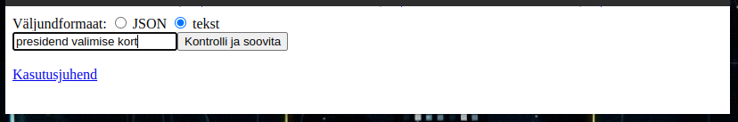
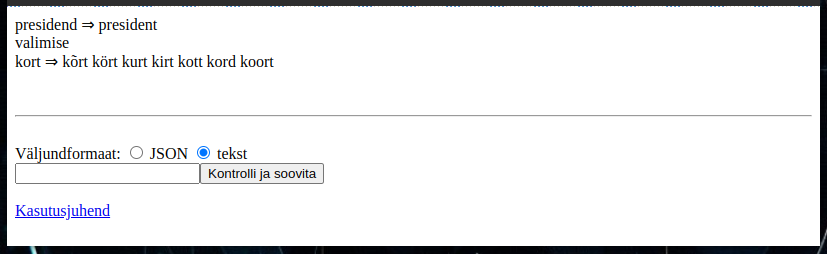
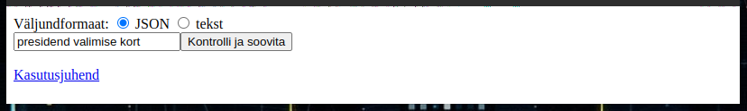
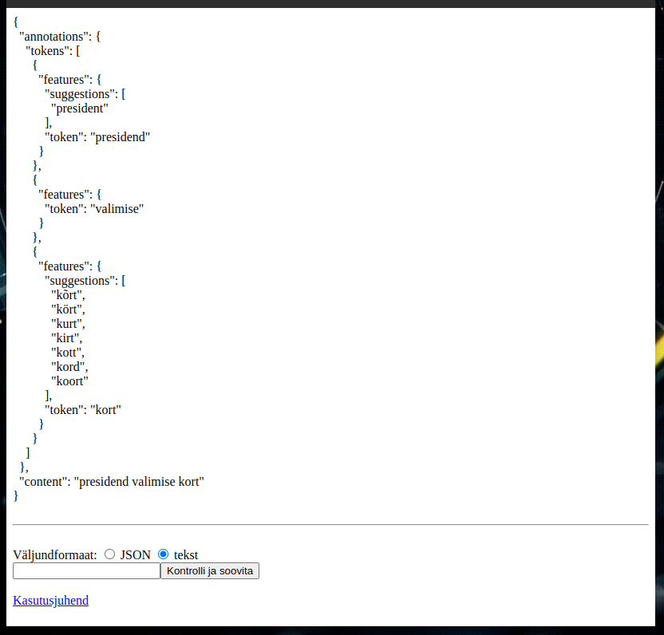

# Veebileht õigekirjakontrollija demonstreerimiseks [versioon 2023.05.22]

[Link veebilehele TÜ serveris](https://smart-search.tartunlp.ai/wp/speller/process)

Tegemist on pealisehitusega õigekirjakontrolli veebiteenusele.

[Pealisehituse lähtekoodi](https://github.com/estnltk/smart-search/tree/main/wp/wp_paring) leiab GITHUBist

Veebelehel saata valida, kas soovite tulemust:

* algse veebiteenuse väljundkujul (JSON formaadis),
* inimesele vaatamiseks mugavamal kujul.

## Näited
---

### Väljund inimesele lugemiseks mõeldud kujul
---



Peale ```Kontrolli ja soovita``` klikkimist näete ekraanil JSON-kujul tulemust.

Kui õigekirjakontrollija ei tundnud sõna ära lisatakse ``` ⇒ ``` märgi taha soovitatavad "õiged" sõnavormid (```presidend ⇒ president ```).

Kui õigekirjakontrollija leiab, et sisendsõna oli normaalne eestikeelne sõna siis seel läheb väljundisse algsel kujul.




### Väljund (veebiteenuse algsel) JSON-kujul
---

[Väljundformaadi kirjeldus](https://github.com/Filosoft/vabamorf/tree/master/docker/flask_stlspeller)

 

Peale ```Kontrolli ja soovita``` klikkimist näete ekraanil JSON-kujul tulemust.



